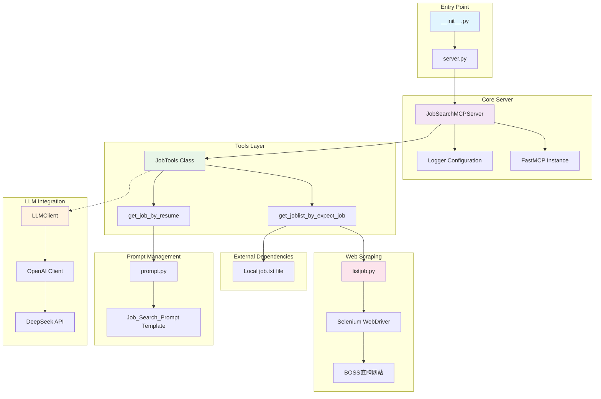

# Job hunting assistant
This is a AI assitant project implemented by python using LLM and relative technics, which aims to help me to find a job.

## Features
- Web crawcle to collect the job descriptions published on the internet.
- According to the market investigation and requirements, optimizing the resume to match the most needed position

## Key Tech Highlight
- LLM's superpower to optimizing text structure
- RAG statege to supply rich context for LLM
- MCP Server to provide the tools LLM need when to take actions

## System Architecture


## Data Flow

- Client requests job recommendations via MCP protocol
- Server retrieves job listings (currently from local file, can use web scraping)
- Combines job data with user resume using AI prompt template
- Sends to DeepSeek API for intelligent matching
- Returns personalized job recommendations and advice

## How run the project
- First, we need to install necessary packages
- Then, prepare the data we need
- Setup environment variables via the .env file
- we use a local chromedriver to do web search, you should download it first

 chromedriver_path="/Users/fengshiyi/Downloads/chromedriver-mac-x64/chromedriver"

- Now, we can use args to specify the working directory and run the server:

```bash
uv --directory /Users/fengshiyi/Downloads/shayne/learning/LLM/py-projects/job-hunting-assistant/src/job_hunting_server run job-hunting-assistant
```

